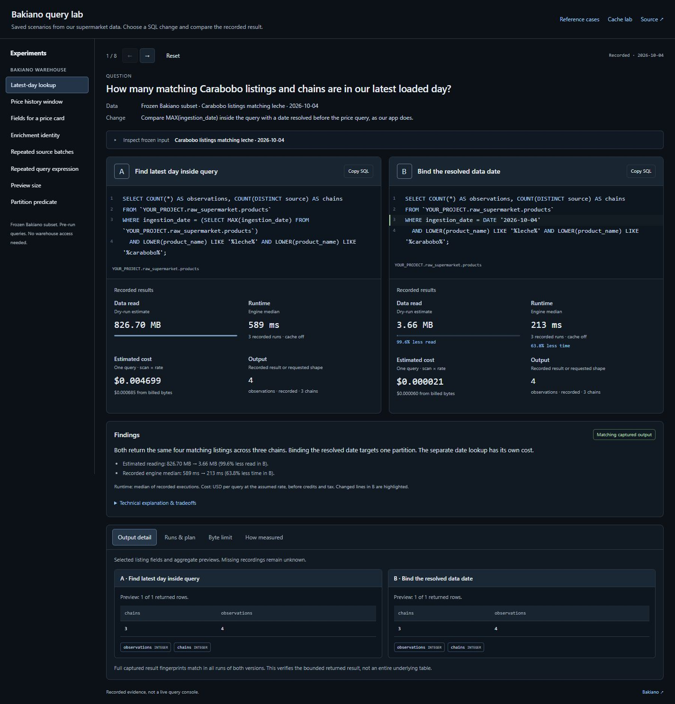
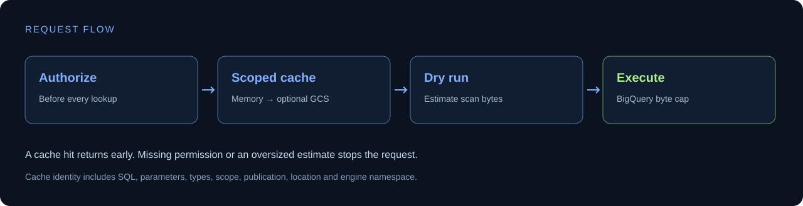

# BigQuery Query Guard

A small JavaScript query boundary for applications using BigQuery: **authorize → cache → dry run → engine-enforced byte limit → trace**.

A standalone adaptation of patterns used at [Bakiano](https://bakiano.com), with explicit cache scopes, publication versioning, in-flight reuse and honest billing metadata.

**[Try the demo](#try-it-without-gcp) · [Integration](#connect-your-own-bigquery-project) · [Design](docs/architecture.md) · [Guarantees](docs/guarantees.md)**

The default demo is a **Bakiano query lab**: a frozen subset of real supermarket listings and pre-run SQL scenarios. Two A/B blocks put each query first, followed by its recorded scan estimate, runtime, cost and output. Findings explain the comparison underneath; the frozen input and execution evidence can be expanded for inspection. It needs no warehouse access. The cache and authorization sandbox remains available at `/guard`.



## Try it without GCP

Node.js 22 or newer. No dependency installation or cloud credentials required.

```sh
git clone https://github.com/alejandrofrank/bigquery-query-guard.git
cd bigquery-query-guard
npm run dev
```

Open **http://127.0.0.1:4312**.

Switch between **eight Bakiano scenarios**: resolving the latest loaded day, history windows, selected columns, enrichment joins, repeated source batches, nested scalar queries, preview limits, and partition predicates. Thirteen query variants were executed three times each. The browser replays bundled input and evidence; it sends no Google Cloud requests and cannot run arbitrary SQL.

Start with the latest-day case: both variants return four matching listings across three chains. Resolving the date first reduces the recorded dry-run estimate from **826.70 MB to 3.66 MB**; engine medians were **589 ms and 213 ms**. The separate date lookup has its own cost, and observed billed bytes differ from estimated scan bytes. These are recorded observations, not a universal speed guarantee.

The displayed subset contains Carabobo listings whose names contain “leche.” Packages and formulations differ. Prices are **as scraped, not normalized USD**. Scan statistics describe the original partitioned warehouse reads, not the byte size of the four-row preview. [Subset, measurements, and reproduction](docs/market-lab.md).

SQL, output previews, execution samples, stages and timestamps are bundled in [`data/market-recording.js`](data/market-recording.js). Private project IDs, job IDs, credentials, source URLs and customer data are omitted.

### Other public reference cases

The earlier **12 public-data experiments** remain at **http://127.0.0.1:4312/reference**. They use taxi trips, Bitcoin and Google Trends to explore additional query behavior. They are separate from the default Bakiano examples.

| Experiment | Recorded observation | What changes |
| --- | --- | --- |
| `LIMIT 100` → `LIMIT 10` | Both estimate 7,487,651,196 bytes | Fewer returned rows; same scan |
| `SELECT *` → three columns | 7,487,651,196 → 978,926,553 bytes | Required fields stay; other fields disappear |
| Date filter on the taxi table | Both estimate 978,926,553 bytes | Narrower answer; no scan reduction |
| Time slice on the Bitcoin view | 130,686,374,250 → 169,415,050 bytes | One day instead of all history |
| Count transactions → sum block counts | 27,659,600 → 23,274,984 bytes | Same verified count, less detail available |
| Seven date partitions → one | 84,718,248 → 11,719,744 bytes | Less history; daily partition metadata inspected |
| `FORMAT_DATE` → direct partition predicate | 377,552,864 → 11,719,744 bytes | Same requested date; very different estimates |
| `UNION ALL` → `UNION DISTINCT` | 310 → 155 output rows counted | Duplicates kept versus removed; different answers |
| Raw join → aggregate before join | Both estimate 256,696,240 bytes | Same captured 100 ordered blocks; different execution work |
| Correlated array aggregate → `UNNEST` | Both estimate 92,065,952 bytes | Same captured total; planner chooses physical strategy |
| Cartesian → keyed join | 24,025 → 155 pairs | Intentionally different result meanings |
| Repeated CTE → one aggregate pass | Both estimate 31,033,312 bytes | Same captured metrics; CTE reuse is not a cache promise |

Measurements were recorded on **2026-10-04** using public datasets: **21 dry runs, 15 eligible queries, 45 completed execution samples**. Six oversized queries have no fabricated runtime. The two count queries returned **657,752** transactions for 2024-01-01 UTC. The summary estimated fewer bytes but had a **3.61 s** engine median versus **613 ms** for counting transactions. Scan size, compute work and elapsed time answer different questions.

Cost uses an adjustable assumed US on-demand rate of **$6.25/TiB**. It shows scan × rate and observed billed bytes × rate separately, before free allowance, discounts and tax. It is not an invoice; scan estimates also exclude billing minimums. Decimal MB/GB are converted to binary TiB for pricing. [Google pricing](https://cloud.google.com/bigquery).

Exact SQL, schemas, timestamps, timings and public execution counters are in [`data/query-estimates.js`](data/query-estimates.js). [Evidence, semantic differences and reproduction](docs/scan-lab.md).

The byte-cap control invokes the **real guard library** with a local adapter. A blocked estimate never reaches that adapter's execution method. An allowed request still does not execute BigQuery, and its billed bytes remain unknown.

At **http://127.0.0.1:4312/guard**, run a simulated query, repeat it, request it from instance B, and try an oversized query. That separate sandbox uses simulated warehouse and shared-cache adapters, with simulated byte counts and local elapsed times labeled.

For a terminal version: `npm run demo`.

### Re-record with BigQuery

Optional: install `@google-cloud/bigquery`, authenticate with Application Default Credentials, and set `GOOGLE_CLOUD_PROJECT` to your own sandbox billing project.

```sh
npm run record:estimates
# Optional: execute two count checks, each capped at 50,000,000 bytes.
npm run record:estimates -- --verify-summary
# Optional: record three bounded runtime samples for eligible queries.
npm run record:estimates -- --benchmark
```

The default recorder submits **21 dry runs only**, plus read-only public source metadata requests. The optional summary check executes two fixed aggregate queries, with `maximumBytesBilled` enforced by BigQuery on each. The recorder saves only public SQL, selected statistics, and output schemas; it omits billing project identifiers, job IDs, identities, and credentials. Commit a refreshed recording only after reviewing the diff. Recording again without execution removes old runtime samples and verified output.

`--benchmark` is a separate opt-in that executes eligible queries three times, sequentially, with query-result-cache reuse disabled. Every attempt reserves its full **300 MB** hard cap against a **15 GB** batch ceiling, including failures. Queries with larger dry-run estimates are skipped. Public sources and estimates can change; the engine may reject a query that was eligible at preflight. Failed or missing measurements stay unknown. This is a small observational sample, not a controlled cold-cache benchmark.

## What it does

| Boundary | Behavior |
| --- | --- |
| Authorization | Mandatory callback on every call, including memory/shared hits |
| Cache identity | SQL, parameters, explicit parameter types, query ID, scope, publication, location and engine namespace |
| Scope | Explicit shared-dataset or tenant scope supplied by the server |
| L1 / L2 | Bounded in-process LRU; optional private Cloud Storage cache |
| Estimate | Reject invalid/unknown estimates or estimates above the configured cap |
| Execution | Pass `maximumBytesBilled` to BigQuery, independently of the estimate |
| Concurrency | Coalesce identical in-flight work within one guard instance |
| Trace | Cache source, estimated bytes, observed billed bytes, native cache hit, cache warnings |
| Billing metadata | Preserve genuine zero; missing billed bytes remain unknown |
| Publication | Await shared writes; report cache failure without hiding query success |



This is a per-query control, **not a monthly budget, SQL sanitizer, general query sandbox, or universal cap on GCP charges**. See [guarantees and limits](docs/guarantees.md).

## Connect your own BigQuery project

Install the optional Google libraries in your checkout:

```sh
npm install @google-cloud/bigquery @google-cloud/storage
gcloud auth application-default login
```

Set `GOOGLE_CLOUD_PROJECT` to your own sandbox billing project. Then:

```sh
node examples/live-bigquery.js
```

That opt-in example sends a constant parameterized query. For GCS reuse, also set `QUERY_CACHE_BUCKET` to a private disposable cache bucket you control. Never use your archive bucket for disposable cache data.

Prefer an attached service identity on Cloud Run rather than exported service-account keys. Authenticate users and authorize reviewed query templates in your application; the example's `local-demo` principal is only for a local script.

### Application shape

```js
import { BigQuery } from '@google-cloud/bigquery';
import { createQueryGuard } from './src/index.js';
import { bigQueryEngine } from './src/bigquery.js';

const guard = createQueryGuard({
  engine: bigQueryEngine(new BigQuery({ projectId }), {
    namespace: projectId + ':catalog-reader-v1',
  }),
  authorize: async request => canReadCatalog(request.principal),
});

// The server chooses SQL, scope, publication and byte limit.
const result = await guard.run({
  principal: authenticatedUser,
  queryId: 'catalog-count-v1',
  sql: 'SELECT COUNT(*) AS count FROM `YOUR_PROJECT.demo.products` WHERE observed_on = @day',
  params: { day: '2026-01-15' },
  types: { day: 'DATE' },
  publication: 'catalog-2026-01-15-revision-2',
  scope: { kind: 'shared', id: 'public-catalog' },
  location: 'US',
  maxBytesBilled: '100000000',
});

console.log(result.rows, result.trace);
```

`projectId`, `authenticatedUser` and `canReadCatalog` are supplied by your application. Keep SQL and policy fields out of untrusted browser requests. Use a tenant scope for private results; do not share results whose contents depend on row-level permissions or execution identity.

This repository is not published to npm. Use the source or a reviewed, pinned Git commit.

## Verify

```sh
npm test
npm run demo
npm run check:public
```

Tests cover authorization before cache, scope isolation, publication invalidation, expiry, concurrent reuse, failure recovery, zero/unknown billing, SDK options, partial-result rejection and GCS handling. Lab checks cover exact SQL/recording agreement, safe metadata publication, capped execution, decimal normalization, TiB pricing, median calculation, and incomplete result comparisons. CI uses mocked cloud adapters; public-data measurements are recorded evidence, not a live cloud integration audit.

## Google Cloud building blocks

- [BigQuery dry runs](https://docs.cloud.google.com/bigquery/docs/samples/bigquery-query-dry-run)
- [Query cost controls](https://cloud.google.com/blog/topics/developers-practitioners/controlling-your-bigquery-costs)
- [Native BigQuery query caching](https://docs.cloud.google.com/bigquery/docs/cached-results)

BigQuery already has a native result cache. This application cache reuses results before submitting another query job. Native cache behavior is still reported separately.

[MIT license](LICENSE) · [Contributing](CONTRIBUTING.md) · Companion: [Catalog Match Lab](https://github.com/alejandrofrank/catalog-match-lab).
