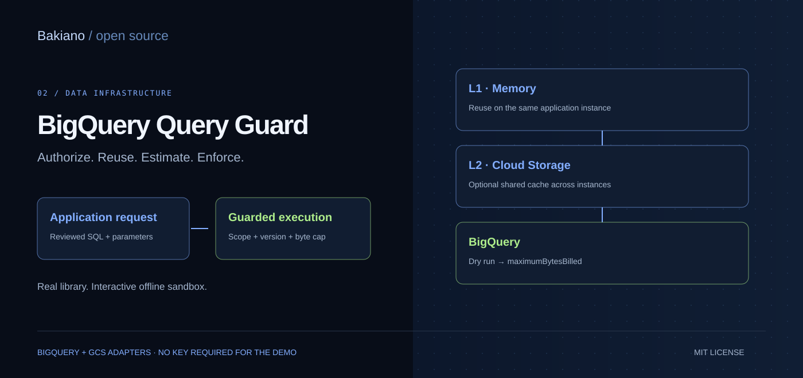
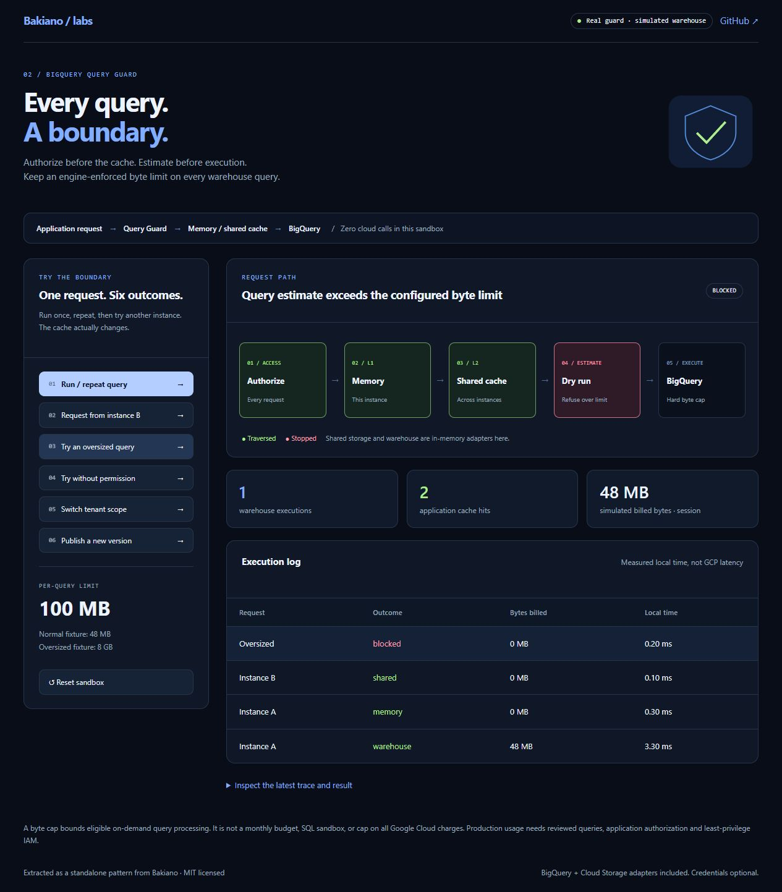

# BigQuery Query Guard

A small JavaScript query boundary for applications using BigQuery: **authorize → cache → dry run → engine-enforced byte limit → trace**.

A standalone adaptation of patterns used at [Bakiano](https://bakiano.com), with explicit cache scopes, publication versioning, in-flight reuse and honest billing metadata.

**[Try the demo](#try-it-without-gcp) · [Integration](#connect-your-own-bigquery-project) · [Design](docs/architecture.md) · [Guarantees](docs/guarantees.md)**



## Try it without GCP

Node.js 22 or newer. No dependency installation or cloud credentials required.

```sh
git clone https://github.com/alejandrofrank/bigquery-query-guard.git
cd bigquery-query-guard
npm run dev
```

Open **http://127.0.0.1:4312**.

Run a query, repeat it, request it from instance B, and attempt an oversized query. The sandbox executes the **real guard library** with simulated warehouse and shared-cache adapters. Local elapsed times and simulated byte counts are labeled; they are not GCP benchmarks or savings claims.

For a terminal version: `npm run demo`.

## What it does

| Boundary | Behavior |
| --- | --- |
| Authorization | Mandatory callback on every call, including memory/shared hits |
| Cache identity | SQL, parameters, explicit parameter types, query ID, scope, publication, location and engine namespace |
| Scope | Explicit shared-dataset or tenant scope supplied by the server |
| L1 / L2 | Bounded in-process LRU; optional private Cloud Storage cache |
| Estimate | Reject invalid/unknown estimates or estimates above the configured cap |
| Execution | Pass `maximumBytesBilled` to BigQuery, independently of the estimate |
| Concurrency | Coalesce identical in-flight work within one guard instance |
| Trace | Cache source, estimated bytes, observed billed bytes, native cache hit, cache warnings |
| Billing metadata | Preserve genuine zero; missing billed bytes remain unknown |
| Publication | Await shared writes; report cache failure without hiding query success |


This is a per-query control, **not a monthly budget, SQL sanitizer, general query sandbox, or universal cap on GCP charges**. See [guarantees and limits](docs/guarantees.md).

## Connect your own BigQuery project

Install the optional Google libraries in your checkout:

```sh
npm install @google-cloud/bigquery @google-cloud/storage
gcloud auth application-default login
```

Set `GOOGLE_CLOUD_PROJECT` to your own sandbox billing project. Then:

```sh
node examples/live-bigquery.js
```

That opt-in example sends a constant parameterized query. For GCS reuse, also set `QUERY_CACHE_BUCKET` to a private disposable cache bucket you control. Never use your archive bucket for disposable cache data.

Prefer an attached service identity on Cloud Run rather than exported service-account keys. Authenticate users and authorize reviewed query templates in your application; the example's `local-demo` principal is only for a local script.

### Application shape

```js
import { BigQuery } from '@google-cloud/bigquery';
import { createQueryGuard } from './src/index.js';
import { bigQueryEngine } from './src/bigquery.js';

const guard = createQueryGuard({
  engine: bigQueryEngine(new BigQuery({ projectId }), {
    namespace: projectId + ':catalog-reader-v1',
  }),
  authorize: async request => canReadCatalog(request.principal),
});

// The server chooses SQL, scope, publication and byte limit.
const result = await guard.run({
  principal: authenticatedUser,
  queryId: 'catalog-count-v1',
  sql: 'SELECT COUNT(*) AS count FROM `YOUR_PROJECT.demo.products` WHERE observed_on = @day',
  params: { day: '2026-01-15' },
  types: { day: 'DATE' },
  publication: 'catalog-2026-01-15-revision-2',
  scope: { kind: 'shared', id: 'public-catalog' },
  location: 'US',
  maxBytesBilled: '100000000',
});

console.log(result.rows, result.trace);
```

`projectId`, `authenticatedUser` and `canReadCatalog` are supplied by your application. Keep SQL and policy fields out of untrusted browser requests. Use a tenant scope for private results; do not share results whose contents depend on row-level permissions or execution identity.

This repository is not published to npm. Use the source or a reviewed, pinned Git commit.

## Verify

```sh
npm test
npm run demo
npm run check:public
```

Tests cover authorization before cache, scope isolation, publication invalidation, expiry, concurrent reuse, failure recovery, zero/unknown billing, SDK options, partial-result rejection and GCS handling. The initial release uses mocked cloud adapters in tests; it does not claim a live cloud integration audit.

## Google Cloud building blocks

- [BigQuery dry runs](https://docs.cloud.google.com/bigquery/docs/samples/bigquery-query-dry-run)
- [Query cost controls](https://cloud.google.com/blog/topics/developers-practitioners/controlling-your-bigquery-costs)
- [Native BigQuery query caching](https://docs.cloud.google.com/bigquery/docs/cached-results)

BigQuery already has a native result cache. This application cache reuses results before submitting another query job. Native cache behavior is still reported separately.

[MIT license](LICENSE) · [Contributing](CONTRIBUTING.md) · Companion: [Catalog Match Lab](https://github.com/alejandrofrank/catalog-match-lab).
