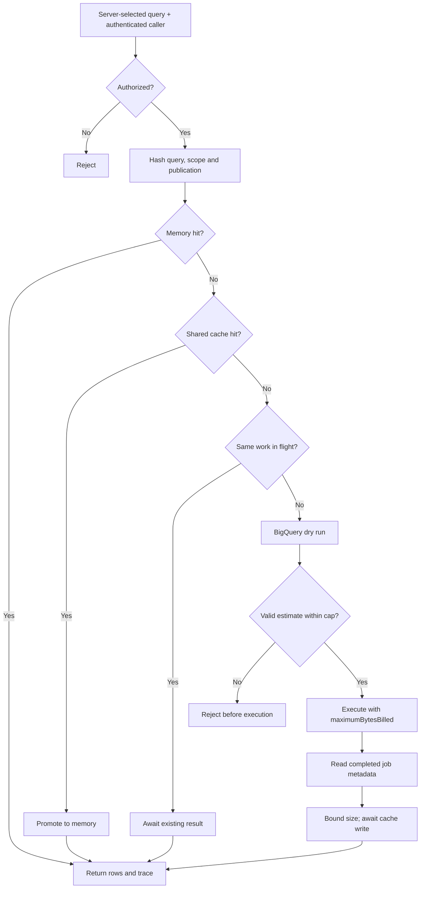

# Architecture

## Cache contract

An entry stores rows and an absolute expiry. Keys include the execution namespace, full SQL, parameters, parameter types, query ID, scope, publication revision and location. A date alone is not enough: increment publication when the same day's data is corrected.

Parameters must be plain JSON. Dates and large integers should be strings paired with explicit BigQuery types. Empty arrays/nulls often require explicit types too.

Shared scopes are only for identical results that every authorized caller in that scope may read. Tenant IDs must come from authenticated server context. Different execution identities need different namespaces. If results depend on finer user permissions, use an appropriately narrower scope or skip shared reuse in a custom adapter.

The default memory store holds 100 entries. The guard caches entries up to 1 MiB for 60 seconds. Configure these to your result shape; entries are cloned to keep callers from mutating cached values. GCS lifecycle deletion is additional cleanup; it does not replace the logical expiry check.

The GCS adapter streams bounded reads, treats missing/corrupt objects as misses, and awaits writes. The optional live example configures bounded SDK retries. A cache failure permits recomputation through the same estimate and execution controls.

## Query contract

The library accepts SQL from trusted application code. It intentionally does not pretend a regular expression can sandbox arbitrary SQL. Use a reviewed query registry and bound parameters; do not hand model-generated SQL directly to this helper.

The Google adapter passes location and explicit parameter types to both estimation and execution. It limits returned results to 10,000 rows by default, rejects paginated/partial output, and reads completed job metadata rather than guessing billed bytes from the dry run.

## Concurrency and usage

Identical requests within one guard instance share in-flight work when their byte limits match. This is not a distributed lock: separate instances can still both execute on a cold shared-cache miss.

A coalesced caller reports zero additional billed bytes; the originating call owns the execution trace. The library does not maintain an account ledger or reconcile invoices. Applications should persist traces through their own reliable request/job lifecycle.

## Cloud Run deployment boundary

Instantiate the guard once per process, using the runtime's attached identity. Grant BigQuery job creation in the billing project, read access only to approved datasets, and object access only to the private cache bucket. Keep the cache bucket separate from archival data; use a short deletion lifecycle and public access prevention.

The included server is a loopback-only visual development harness. It does not expose a live SQL endpoint. No production resources, Terraform state or service-account keys are included.
